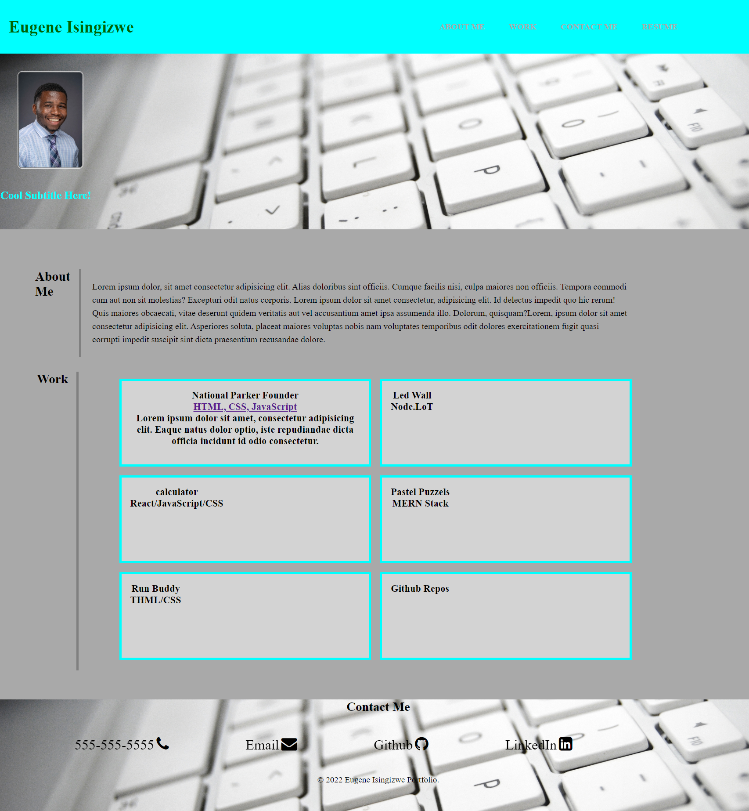

# Eugene Isingzwe Portfolio

## Description

- The motivation behind this project is to build on the HTML and CSS skilled learned in the previous weeks by creating a personal portfolio to showcase to future employers. The project is in the beginning phase thus only HTML and CSS is applied. 
- This project was built to showcase my skills and talents to future employers looking to fill a part-time or full-time position. 
- Having an effective and efficient portfolio typically enhance a very successful career search upon the completion of the bootcamp.  Therefore it solves the problem of having not having to start over to showcase your work and you are able to add on to the project as you develop more skills. 
- Creating this project, I learned and was able advance my HTML and CSS skills by applying advance CSS concepts such as flexbox, media queries’, CSS variables, applying background images, and various other CSS concepts. 

## User Story
- AS AN employer
- I WANT to view a potential employee's deployed portfolio of work samples
- SO THAT I can review samples of their work and assess whether they're a good candidate for an open position

## Acceptance Creteria 
GIVEN I need to sample a potential employee's previous work
WHEN I load their portfolio
THEN I am presented with the developer's name, a recent photo or avatar, and links to sections about them, their work, and how to contact them
WHEN I click one of the links in the navigation
THEN the UI scrolls to the corresponding section
WHEN I click on the link to the section about their work
THEN the UI scrolls to a section with titled images of the developer's applications
WHEN I am presented with the developer's first application
THEN that application's image should be larger in size than the others
WHEN I click on the images of the applications
THEN I am taken to that deployed application
WHEN I resize the page or view the site on various screens and devices
THEN I am presented with a responsive layout that adapts to my viewport

## Link To Deployed Application 
https://eugeneisingizwe.github.io/My-Portfolio/ 

## Mock-Up

