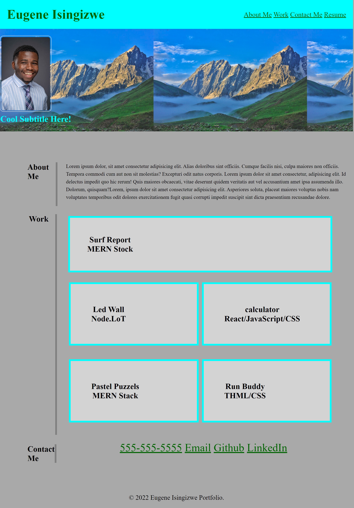

# Eugene Isingzwe Portfolio

## Description

- The motivation behind this project is to build on the HTML and CSS skilled learned in the previous weeks by creating a personal portfolio to showcase to future employers. The project is in the beginning phase thus only HTML and CSS is applied. 
- This project was built to showcase my skills and talents to future employers looking to fill a part-time or full-time position. 
- Having an effective and efficient portfolio typically enhance a very successful career search upon the completion of the bootcamp.  Therefore it solves the problem of having not having to start over to showcase your work and you are able to add on to the project as you develop more skills. 
- Creating this project, I learned and was able advance my HTML and CSS skills by applying advance CSS concepts such as flexbox, media queries’, CSS variables, applying background images, and various other CSS concepts. 

##Link To Deployed Application 

## Usage

